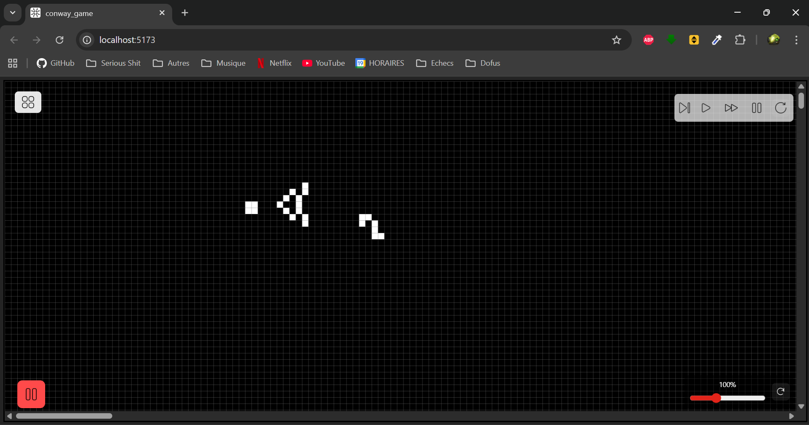
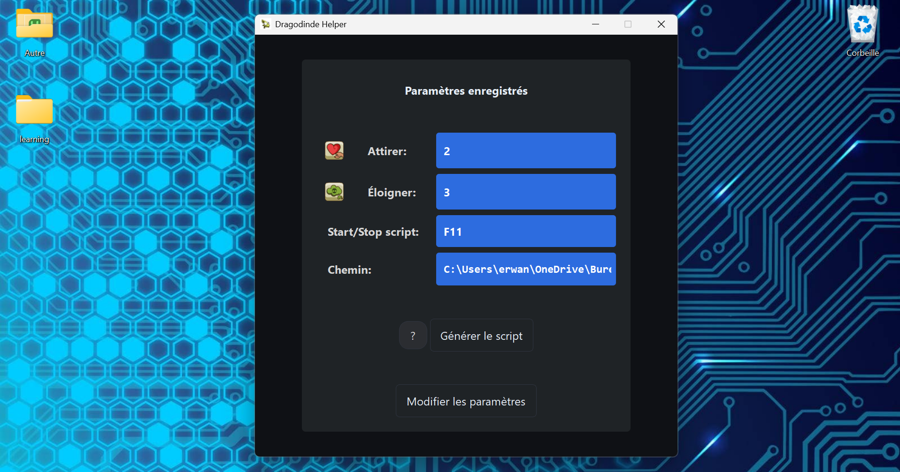
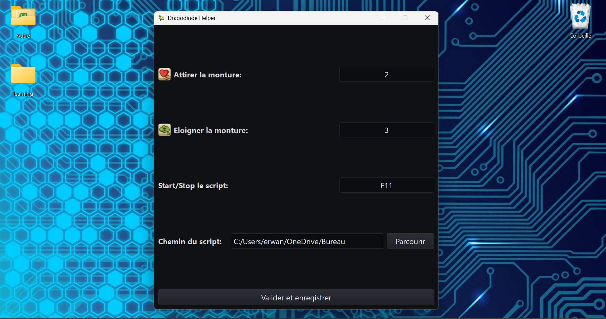

# Portfolio de Erwan Rossignol

Bonjour, je m'appelle Erwan Rossignol, développeur Full Stack passionné par les projets webs/mobile modernes.

## Projets

### 1. Jeu de la vie de Conway (React, TypeScript, Tailwind)

Cette application web permet à l'utilisateur de découvrir, naviguer et explorer le jeu de la vie de John Conway (règles expliquées dans le fichier README.md du repository)

- Fonctionnalités: choix de la position de départ, choix de la vitesse d'exécution du jeu, drag and drop de plusieurs patterns phares du jeu de la vie
- [Repo GitHub](https://github.com/E-Rossignol/conway_game.git)
  
  
- 

### 2. Aide à l'élevage de dragodinde (Python, PyQt5)

Cette application Desktop (fichier ".exe" disponible) permet à l'utilisateur de générer un script compatible avec le logiciel AutoHotKey lui permettant de simplifier et accélérer l'élevage de Dragodindes dans le MMORPG "Dofus" d'Ankama. L'application permet, via des raccourcis définis et modifiables dans l'onglet "Modifier les paramètres", d'activer et désactiver un script qui alternera les "emotes" en jeu afin de simplifier et d'accélérer grandement l'élevage de Dragodindes. 
- Fonctionnalités: choix des raccourcis des emotes, choix des raccourcis d'activation/désactivation du script généré, choix de l'emplacement du script généré ainsi que son nom, génération du script, modification des paramètres et réécriture du script
- [Repo GitHub](https://github.com/E-Rossignol/dragoturkey_helper.git)
- 
- 